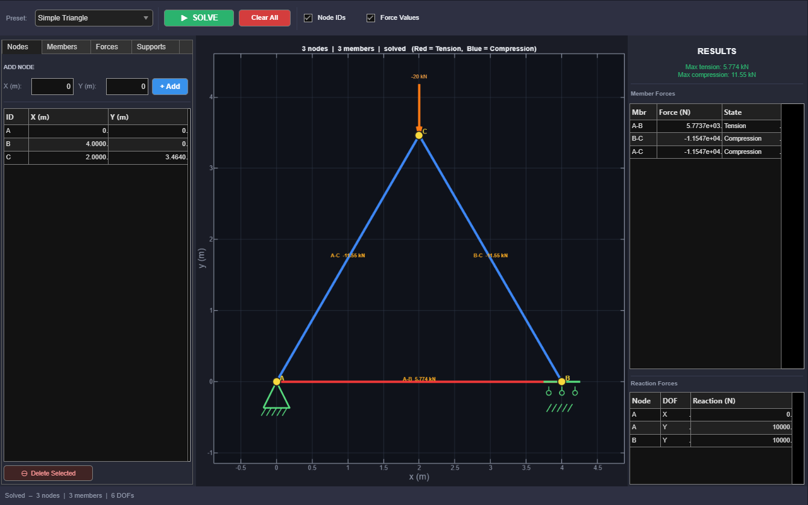
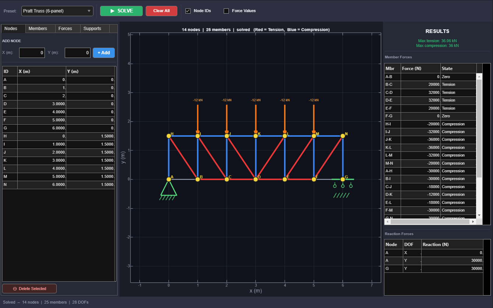
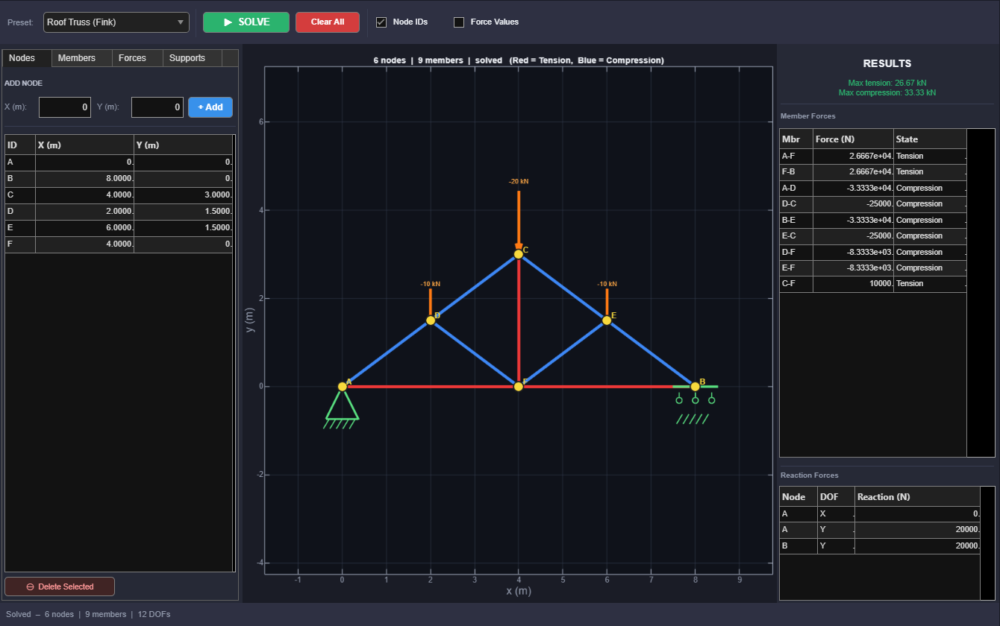

# 2-D Truss Solver

A compact MATLAB app for linear-elastic, pin-jointed 2-D trusses. It solves
nodal displacements, axial member forces, and support reactions with the direct
stiffness method.

## Requirements

- MATLAB with support for `uifigure` and the `matlab.unittest` framework
- No third-party toolboxes or packages

The app and regression tests have been verified with MATLAB R2025b.

## Run

In MATLAB, change to this folder and run:

```matlab
truss_ui
```

Choose a preset or enter nodes, members, loads, and supports manually. Press
**SOLVE** to analyze the current model. Positive member forces are taken to be in
tension and negative forces are compression.

Run the regression tests with:

```matlab
runtests({'test_truss_engine.m','test_truss_ui.m'})
```

## Screenshots and example results

The values below were captured from the included presets in MATLAB R2025b.
Member forces use the solver sign convention: positive is tension and negative
is compression.

### Simple Triangle



The preset applies a 20 kN downward load at node C.

| Member | Force (kN) | State |
| --- | ---: | --- |
| A-B | 5.774 | Tension |
| B-C | -11.547 | Compression |
| A-C | -11.547 | Compression |

| Reaction | Value (kN) |
| --- | ---: |
| A-X | 0 |
| A-Y | 10.000 |
| B-Y | 10.000 |

### Six-panel Pratt truss



Five 12 kN downward loads produce 30 kN vertical reactions at each support.
The largest tensile force is 36.056 kN in the outer diagonals B-H and F-N;
the largest compressive force is 36.000 kN in top-chord members J-K and K-L.

| Representative member | Force (kN) | State |
| --- | ---: | --- |
| A-B | 0 | Zero-force |
| D-E | 32.000 | Tension |
| J-K | -36.000 | Compression |
| B-H | 36.056 | Tension |

### Fink roof truss



The three roof loads total 40 kN, balanced by 20 kN at each vertical support
reaction. The bottom chords carry 26.667 kN in tension, the outer rafters carry
33.333 kN in compression, and the king post carries 10.000 kN in tension.

## Scope and assumptions

- 2-D pin-jointed bars with axial stiffness only
- Linear elasticity and small displacements
- One shared Young's modulus (`E = 200 GPa`) and area (`A = 0.01 m^2`)
- Loads applied at nodes
- Pin, horizontal-restraint roller, and vertical-restraint roller supports
- SI units: metres, newtons, pascals

This is a complete educational member-force solver. It is not a design-code or
member-sizing package: it does not check stress, buckling, deflection limits,
load combinations, or safety factors.
